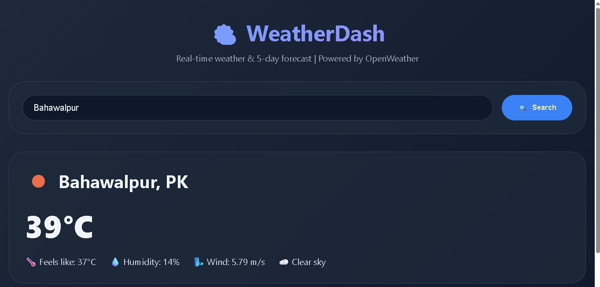
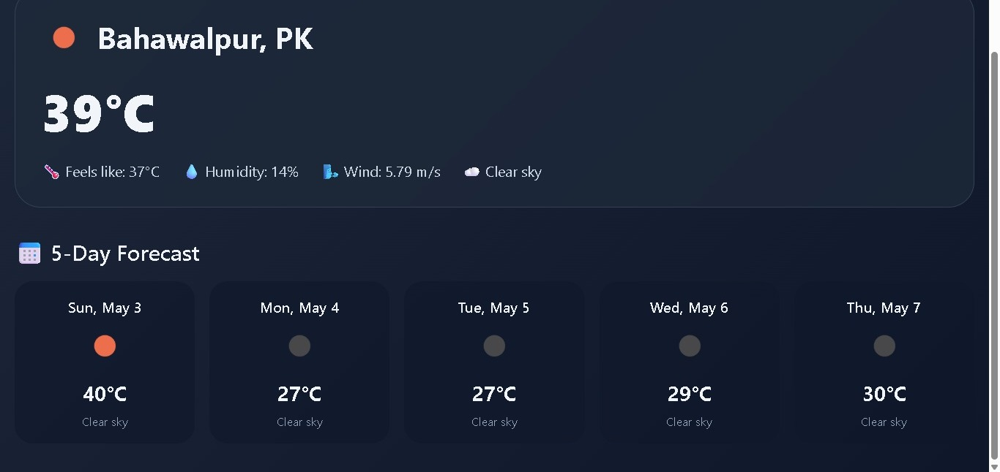

# 🌤️ WeatherDash

A production-ready weather dashboard built with **Flask** and **OpenWeather API**. Get real-time weather conditions and 5-day forecast for any city in the world. Features server-side caching to reduce API calls and improve performance.

🔗 **Live Demo:** [https://weather-dash.onrender.com](https://weather-dash.onrender.com) *(after deployment)*

---

## ✨ Features

- 🔍 **Search weather by city name** – instant results
- 🌡️ **Current weather** – temperature, feels like, humidity, wind speed, condition
- 📅 **5-day forecast** – one forecast per day (at 12:00 PM)
- ⚡ **Server-side caching** – caches results for 10 minutes, reduces API calls by 90%
- 🎨 **Modern responsive UI** – works perfectly on mobile, tablet, and desktop
- 🚫 **Graceful error handling** – invalid city names and API errors handled smoothly

---

## 🛠️ Tech Stack

| Category | Technologies |
|----------|--------------|
| **Backend** | Flask (Python) |
| **API** | OpenWeather REST API |
| **Caching** | In-memory time-based cache (10 min TTL) |
| **Frontend** | HTML5, CSS3, JavaScript (vanilla) |
| **Deployment** | Render / PythonAnywhere / Railway |
| **Version Control** | Git & GitHub |

---

## 📂 Project Structure
WeatherDash/

├── app.py # Flask backend with caching logic

├── requirements.txt # Python dependencies

├── .env # Environment variables (API key) – not committed

├── templates/

│ └── index.html # Frontend (HTML, CSS, JS)

└── README.md # Project documentation

## 🚀 Local Setup & Installation

Follow these steps to run the project on your local machine:

### Prerequisites

- Python 3.8 or higher installed
- 
- OpenWeather API key ([get it here](https://home.openweathermap.org/api_keys) – free tier works)

### Step 1: Clone the repository

git clone https://github.com/YOUR_USERNAME/WeatherDash.git

cd WeatherDash

Step 2: Create a virtual environment (recommended)

python -m venv venv

# On Windows:

venv\Scripts\activate

# On Mac/Linux:

source venv/bin/activate

Step 3: Install dependencies

pip install -r requirements.txt

Step 4: Set up environment variable

Create a .env file in the root directory and add your API key:

OPENWEATHER_API_KEY=your_actual_api_key_here

(Alternatively, directly modify app.py and replace your_api_key_here)

Step 5: Run the application

python app.py

Step 6: Open in browser

Navigate to http://127.0.0.1:5000

☁️ Deployment Guide

This app is ready to deploy on any Flask-compatible platform:

Deploy on Render (Recommended – Free)

Push code to GitHub repository.

Log in to Render.com.

Click "New +" → "Web Service".

Connect your GitHub repo.

Set:

Build Command: pip install -r requirements.txt

Start Command: gunicorn app:app

Add environment variable: OPENWEATHER_API_KEY = your key.

Click "Create Web Service".

Your app will be live at https://your-app.onrender.com within minutes.

Deploy on PythonAnywhere

Upload files manually or via Git.

Set WSGI configuration to point to app:app.

Add API key in environment variables.

🔑 Environment Variables

Variable	Description

OPENWEATHER_API_KEY	Your OpenWeatherMap API key (required)

🧪 Testing the Application

Enter a city name (e.g., London, Karachi, Tokyo).

Click Search or press Enter.

Current weather and 5-day forecast will appear.

Search for the same city again – notice the "Cached" badge appears (within 10 minutes).

📸 Screenshots

🤝 Contributing
Contributions, issues, and feature requests are welcome!
Feel free to check the issues page.

📝 License
This project is open source and available under the MIT License.

👨‍💻 Author
Muhammad Younas

GitHub: @Code-art-by-younas

LinkedIn: Muhammad Younas

Email: codewithyounas@gmail.com

🙏 Acknowledgements

OpenWeatherMap for providing the weather API

Flask for the lightweight web framework

Render for free hosting
